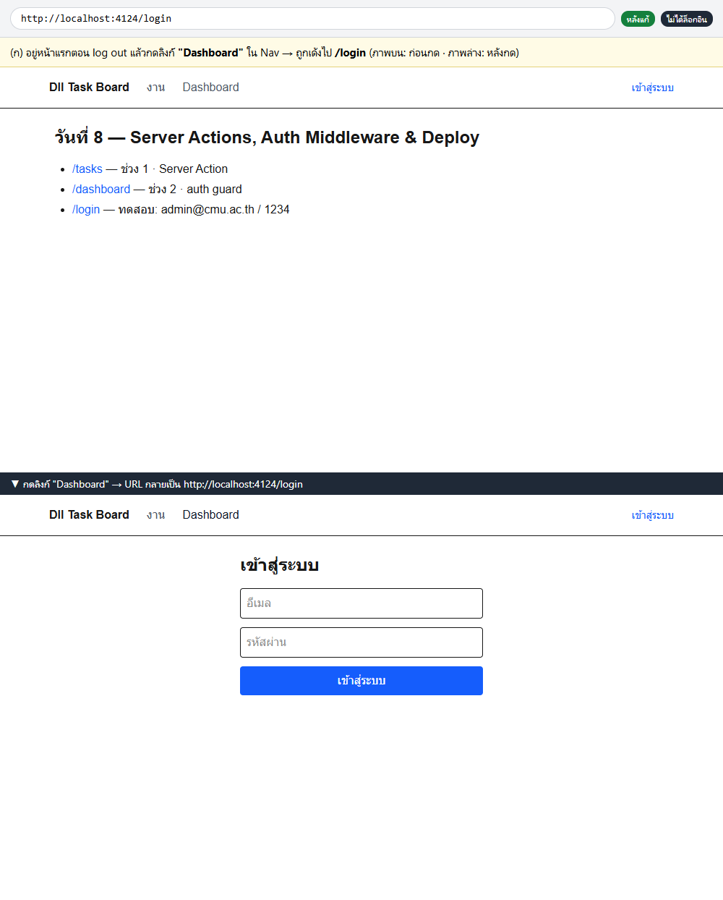
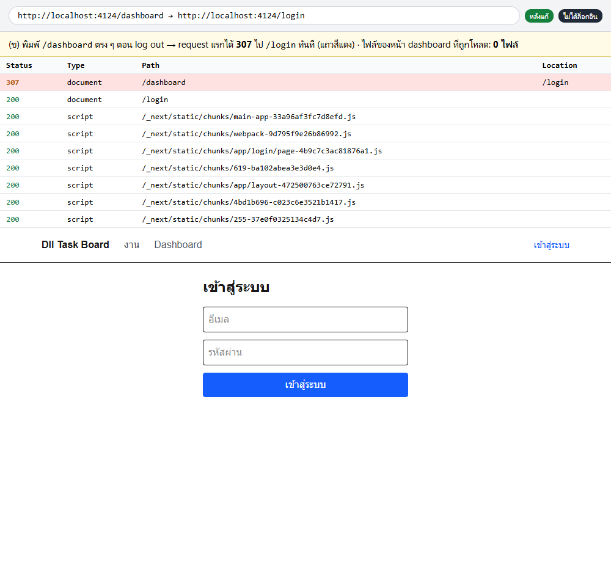
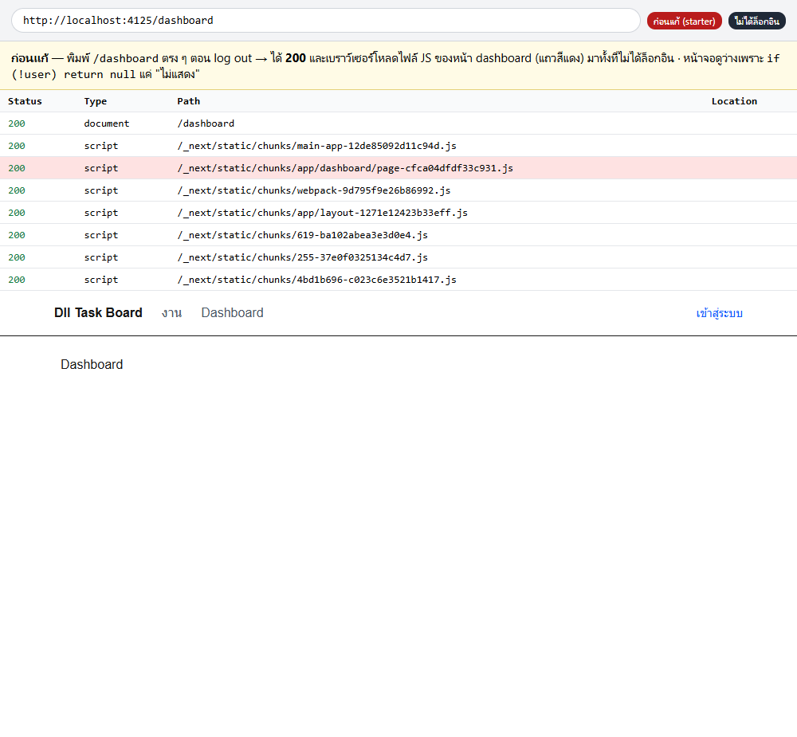
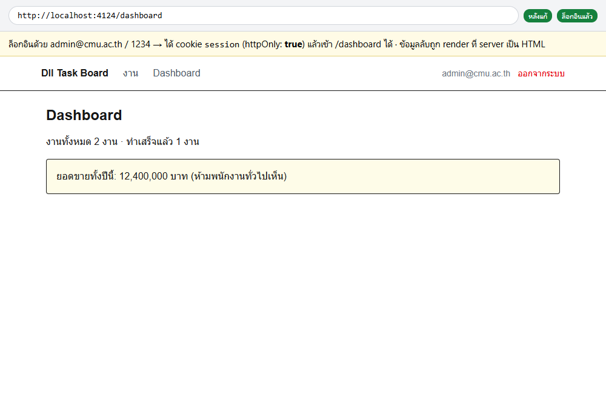
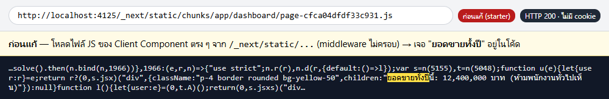
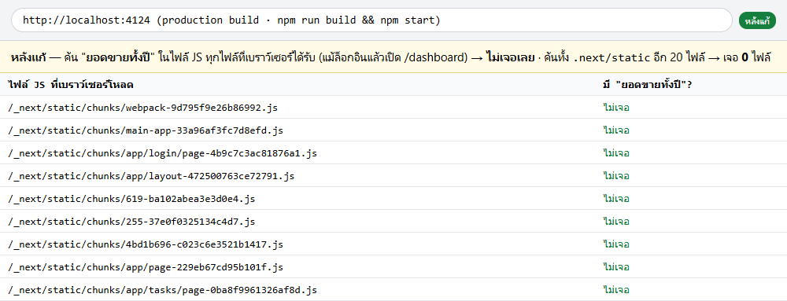

# `lab-day-08-b-start` — โปรเจกต์ตั้งต้นของ **Lab B** วันที่ 8

โปรเจกต์ใหม่สำหรับ **Lab B — Auth Middleware + ความลับต้องอยู่ฝั่ง server** (🎯 มินิแอป #5) · ⏱ **Lab B 14:00–14:50 · Explain-Back 14:50–15:00**
**ทุกกลุ่มเริ่ม Lab B จากโปรเจกต์นี้** — ไม่ต่อจากโปรเจกต์ Lab A และไม่ก๊อปอะไรทับ · Lab A ทำจบหรือไม่ไม่มีผลกับ Lab B

> 🔀 Lab A อยู่ในโปรเจกต์ `lab-day-08-start` (commit + push ไว้ตอน 13:55) · โปรเจกต์นี้คือ**ที่ที่เขียน Lab B แล้ว push ขึ้น GitHub repo ใหม่** · **ไม่ต้อง deploy** (ฝึกไปแล้วตอนเช้า)
> 💡 แตก zip + `npm install` ไว้ตั้งแต่พักเที่ยง จะได้เริ่มทันที 14:00
> = `lab-day-08-start` ทุกไฟล์ — `app/tasks/*` และ `lib/taskStore.js` ยังเป็น TODO ของ Lab A **ไม่ต้องทำซ้ำ** (`/dashboard` ใช้แค่ `getTasks()` ที่มีให้แล้ว)
> 🔓 AI ใช้ได้ตามกติกาปกติ — อธิบายทุกบรรทัดได้เมื่อ TA ถาม · ⚠️ AI รุ่นเก่ามักลืม `await cookies()` (Next.js 15)

---

## เริ่มยังไง

```bash
npm install
cp .env.local.example .env.local     # แล้วแก้ค่าเอง — .env.local ไม่เข้า git
npm run dev
```

| ปัญหา | ทางแก้ |
|---|---|
| หัวเว็บขึ้น `(ยังไม่ตั้ง NEXT_PUBLIC_SITE_NAME)` | ยังไม่มี `.env.local` หรือแก้แล้วยังไม่ restart dev server · บน `npm start` = ค่า `NEXT_PUBLIC_` ถูกฝังตอน build ต้อง `npm run build` ใหม่ |
| เพิ่มงานแล้ว restart dev server งานหาย | ปกติ — `lib/taskStore.js` เก็บในหน่วยความจำ ไม่ใช่ database |
| `/login` ขึ้นแค่ TODO | งาน Lab B ขั้น A |
| `/dashboard` เข้าได้ทั้งที่ไม่ล็อกอิน | ใช่ — นี่คือเวอร์ชันไม่ปลอดภัยของเช้านี้ งาน Lab B ขั้น B |

## ไฟล์ที่ต้องเขียน

```
app/
├── login/
│   ├── page.jsx            ← ขั้น A ฟอร์ม login
│   └── actions.js          ← ขั้น A (login + logout)
├── dashboard/
│   ├── page.jsx            ← รื้อเป็น Server Component
│   └── DashboardPanel.jsx  ← ลบทิ้งทั้งไฟล์ (ขั้น D — ข้อความลับต้องหายจาก JS)
├── tasks/                  ✗ งาน Lab A — ไม่ต้องแตะ
└── layout.jsx              ✓ อ่าน cookie ส่งให้ AuthContext (ไม่ต้องแก้)
components/Nav.jsx          ← ปุ่ม "ออกจากระบบ"
middleware.js               ← ขั้น B สร้างเองที่ราก project (นอก app/)
README.md                   ← หลักฐาน Twist (ภาพ DevTools + คำอธิบาย) เขียนต่อท้ายไฟล์นี้
```

> ⚠️ อย่าลบ `await cookies()` ใน `app/layout.jsx` — มันทำให้ทุกหน้าเป็น dynamic (`ƒ`)

---

# โจทย์ (สำเนาส่วน Lab B จาก `labs/day-08.md`)

## Lab B (50 น. · 14:00–14:50) — Auth Middleware + ความลับต้องอยู่ฝั่ง server

**Starter: `lab-day-08-b-start` — โปรเจกต์ใหม่ ทุกกลุ่มเริ่มจากจุดเดียวกัน** (ไม่ใช่ต่อจากโปรเจกต์ Lab A — ทำ Lab A จบหรือไม่ไม่มีผลกับ Lab B) · สร้าง GitHub repo ใหม่ให้โปรเจกต์นี้แล้ว commit + push ก่อน 14:50 (TA ตรวจจาก repo นี้ · **ไม่ต้อง deploy**) · `app/tasks/` ในโปรเจกต์นี้ยังเป็น TODO ของ Lab A ตามเดิม **ไม่ต้องทำซ้ำ** (`/dashboard` ใช้แค่ `getTasks()` ที่มีให้แล้ว) · ⚠️ **ต่างจากตอนเช้า:** `app/login/page.jsx` และ `app/login/actions.js` เป็น **TODO เปล่า** (ตอนเช้าอาจารย์มีให้ครบ) และปุ่ม "ออกจากระบบ" ใน `components/Nav.jsx` ยังเป็น TODO — ทั้ง 3 จุดเป็นงานขั้น A · ยังไม่มี `middleware.js` (ขั้น B)

**Context:** เวอร์ชันเช้านี้ของ `/dashboard` เช็ก auth ที่ Client Component (`if (!user) return null`) — พิสูจน์ไปแล้วตอนเช้าว่าโค้ดและข้อมูลลับทั้งหมดหลุดไปอยู่ใน JS bundle ตั้งแต่ก่อนเช็กเงื่อนไขด้วยซ้ำ บ่ายนี้ให้รื้อของเดิมทิ้ง แล้วสร้างระบบล็อกอินจริง + `middleware.js` ที่เช็กที่ **server ก่อน**ตอบ request ใด ๆ กลับไปเลย

| ขั้น | เวลา | ทำอะไร |
|---|:--:|---|
| **A. Mock login + cookie** | 10 น. | เขียนฟอร์ม `/login` + Server Action `login(prevState, formData)` ที่เทียบ email/password กับค่า mock แล้ว `(await cookies()).set('session', ..., { httpOnly: true, path: '/' })` ถ้าถูกต้อง (Next.js 15: `cookies()` เป็น async ต้อง `await`) |
| **B. `middleware.js`** | 15 น. | สร้างที่ราก project นอก `app/` — เช็ก cookie `session` ก่อนปล่อยเข้า `/dashboard` ไม่มี → `NextResponse.redirect(new URL('/login', request.url))` มี → `NextResponse.next()` ตั้ง `matcher: ['/dashboard/:path*']` |
| **C. พิสูจน์ว่าไม่รั่ว** | 10 น. | Log out → เปิด DevTools **Sources**/**Network** → พิมพ์ `/dashboard` ตรง ๆ ใน address bar → ต้องเห็น **redirect ก่อน**ไฟล์ของหน้า dashboard จะถูกโหลดเลย (เทียบกับตอนเช้าที่โหลดมาเต็ม ๆ ทั้งที่ log out) — แคปหน้าจอทั้ง 2 เวอร์ชันเก็บไว้ |
| **D. ความลับไม่หลุดไป client** | 15 น. | รื้อ `/dashboard` เป็น **Server Component** (ไม่มี `"use client"`) ที่อ่าน `getTasks()` ฝั่ง server → **ลบ `DashboardPanel.jsx` ทิ้งทั้งไฟล์** → ตั้ง `SESSION_SECRET` (ไม่มี prefix) และ `NEXT_PUBLIC_SITE_NAME` (มี prefix) ใน `.env.local` ไม่ hardcode → `npm run build && npm start` → DevTools **Sources** กด Ctrl+Shift+F ค้น `ยอดขายทั้งปี` ต้อง**ไม่เจอ**ในไฟล์ JS ใด ๆ (ก่อนรื้อ ลองค้นดูก่อน — จะเจอใน `page-*.js`) |

---

### Twist

1. 🔴 **(ทดสอบในโปรเจกต์ Lab A) ปิด JavaScript ในเบราว์เซอร์แล้วฟอร์มเพิ่ม/ลบ/mark-done ต้องยังทำงานได้ทั้ง 3 อย่าง** (progressive enhancement) — เปิด DevTools → Settings → Debugger → Disable JavaScript แล้วทดสอบทีละปุ่ม หน้าจะ reload เต็มหน้าแทนที่จะ smooth แต่ mutation ต้องสำเร็จทุกครั้ง
2. 🔴 **ต้องพิสูจน์ด้วยภาพว่าคนไม่ล็อกอินเข้าหน้า protected ไม่ได้ ทั้งจาก UI และจาก direct URL** — แคป (ก) กดลิงก์ไปหน้า dashboard ตอน log out แล้วโดนเด้ง (ข) พิมพ์ URL `/dashboard` ตรง ๆ ใน address bar ตอน log out แล้วโดนเด้งเหมือนกัน พร้อม Network tab ที่เห็น status `307` **ก่อน**มีไฟล์ของหน้า dashboard โหลดเข้ามา
3. 🔴 **ใส่ middleware แล้วยังไม่พอ — ข้อความลับต้องหายไปจาก JS ที่ส่งให้เบราว์เซอร์** — middleware กันแค่ request ที่ไป `/dashboard` แต่ไฟล์ JS ของ Client Component อยู่ที่ `/_next/static/...` ซึ่ง `matcher` ไม่ครอบ ใครรู้ URL ก็โหลดได้โดยไม่ต้องล็อกอิน · ทดสอบบน **production build** (`npm run build && npm start`) ไม่ใช่ `npm run dev` เพราะ dev ไม่ได้ bundle แบบเดียวกับที่ผู้ใช้จริงได้รับ
4. 🔴 **ห้าม hardcode ความลับ (เช่น session secret) ลงในโค้ดที่ commit เข้า git** — ต้องอยู่ใน `.env.local` (gitignore อัตโนมัติ) เท่านั้น — TA เปิด repo ค้นต้องไม่เจอค่าจริง (`.env.local.example` ใส่ได้แค่ค่าตัวอย่าง)

---

**Lab B — คุณภาพ (40% ของคะแนนวันนี้)**
- middleware auth guard บล็อกกรณีไม่ล็อกอินได้จริง — 40%
- อธิบายได้ว่าทำไม server-side guard ปลอดภัยกว่า client-side guard เดิม — 30%
- ความลับไม่หลุดไปฝั่ง client: `/dashboard` เป็น Server Component · `DashboardPanel.jsx` ถูกลบ (ค้น `ยอดขายทั้งปี` ใน DevTools บน production build ต้องไม่เจอ) · secret อยู่ใน `.env.local` ไม่ hardcode — 30%

---

# หลักฐาน Twist (Lab B)

> ทดสอบทั้งหมดบน **production build** (`npm run build && npm start`) · ผลด้านล่างได้จากการยิง HTTP request จริงด้วย `curl` ทั้งเวอร์ชันก่อนแก้ (starter) และหลังแก้

## Twist 2 — คนไม่ล็อกอินเข้า `/dashboard` ไม่ได้ ทั้งจาก UI และ direct URL

`middleware.js` รันที่ server **ก่อน** Next.js render หน้าใด ๆ — ถ้าไม่มี cookie `session` ที่ลายเซ็นถูกต้องจะตอบ `307` ไป `/login` ทันที เบราว์เซอร์จึงไม่ได้รับ HTML/JS ของหน้า dashboard เลย

| กรณี | ก่อนแก้ (client-side guard) | หลังแก้ (middleware) |
|---|:--:|:--:|
| `GET /dashboard` ไม่มี cookie | `200` — ได้หน้าเต็ม ๆ | **`307` → `/login`** |
| `GET /dashboard` cookie ปลอม `session=admin@cmu.ac.th.deadbeef` | — | **`307` → `/login`** (ลายเซ็นไม่ตรง) |
| login ผิดรหัส | — | `200` + ข้อความ `อีเมลหรือรหัสผ่านไม่ถูกต้อง` · ไม่ได้ cookie |
| login ถูก (`admin@cmu.ac.th` / `1234`) | — | `303` → `/dashboard` · ได้ cookie `session` แบบ **HttpOnly** |
| `GET /dashboard` พร้อม cookie ที่ถูกต้อง | — | `200` เห็นข้อมูล dashboard |
| logout แล้ว `GET /dashboard` | — | **`307` → `/login`** |

### ภาพหน้าจอ

ถ่ายด้วย Chrome แบบ headless ผ่าน Puppeteer บน production build — "ก่อนแก้" รันจาก starter ต้นฉบับ (แตกจาก zip ใหม่) · ตาราง network คือ response ทุกตัวที่ Chrome ได้รับจริงตามลำดับ (บันทึกผ่าน Puppeteer ไม่ใช่ภาพ DevTools)

**(ก) กดลิงก์ "Dashboard" ใน Nav ตอน log out → โดนเด้งไป `/login`**


**(ข) พิมพ์ `/dashboard` ตรง ๆ ตอน log out → `307` ก่อน และไม่มีไฟล์ของหน้า dashboard ถูกโหลดเลย**


**เทียบ: ก่อนแก้ — ได้ `200` และโหลด `app/dashboard/page-*.js` มาทั้งที่ log out**


**ล็อกอินถูกต้อง → ได้ cookie httpOnly แล้วเข้า dashboard ได้**


## Twist 3 — ข้อความลับต้องหายไปจาก JS ที่ส่งให้เบราว์เซอร์

middleware ครอบแค่ `/dashboard/:path*` แต่ไฟล์ JS อยู่ที่ `/_next/static/...` ซึ่ง matcher ไม่ครอบ — ถ้าข้อความลับอยู่ใน Client Component ใครรู้ URL ก็โหลดไฟล์ได้เลย วิธีแก้คือรื้อ `/dashboard` เป็น **Server Component** และลบ `DashboardPanel.jsx` ทิ้ง → ข้อความลับถูก render เป็น HTML ที่ server เท่านั้น ไม่ถูก bundle ลง JS

| ตรวจสอบ | ก่อนแก้ | หลังแก้ |
|---|---|---|
| ค้น `ยอดขายทั้งปี` ใน `.next/static/` | เจอใน `chunks/app/dashboard/page-4d3b3f11caa0b2b5.js` | **ไม่เจอในไฟล์ใดเลย** ✅ |
| `GET` ไฟล์ JS นั้นโดยไม่มี cookie | `200` — โหลดได้ทั้งที่ไม่ล็อกอิน | ไฟล์นี้ไม่มีข้อความลับแล้ว |
| `app/dashboard/page.jsx` มี `"use client"` | มี | **ไม่มี** |
| `app/dashboard/DashboardPanel.jsx` | มี | **ลบแล้ว** |

> ชื่อไฟล์ `page-<hash>.js` เปลี่ยนทุกครั้งที่ build ใหม่ — ในภาพด้านล่างจึงเป็นอีก hash หนึ่ง แต่เป็นไฟล์เดียวกัน (`chunks/app/dashboard/page-*.js`)

### ภาพหน้าจอ

**ก่อนแก้ — โหลดไฟล์ JS ของ dashboard ตรง ๆ โดยไม่มี cookie แล้วเจอข้อความลับ**


**หลังแก้ — ค้นในไฟล์ JS ทุกไฟล์ที่เบราว์เซอร์ได้รับ (แม้ล็อกอินแล้วเปิด /dashboard) และใน `.next/static` ทั้งหมด → ไม่เจอ**


## Twist 4 — ไม่ hardcode ความลับลงในโค้ด

- `SESSION_SECRET` อ่านจาก `process.env` ใน `lib/session.js` เท่านั้น ใช้เซ็น cookie `session` ด้วย HMAC-SHA256 — ค่าจริงอยู่ใน `.env.local` ซึ่งถูก `.gitignore` (`.env*`) กันไว้ ไม่เข้า git
- `SESSION_SECRET` **ไม่มี** prefix `NEXT_PUBLIC_` → อ่านได้เฉพาะฝั่ง server · ค้นค่าของมันใน `.next/static/` แล้ว**ไม่เจอ** ✅
- `NEXT_PUBLIC_SITE_NAME` **มี** prefix → ตั้งใจให้ถูกฝังลง JS เพราะ `Nav.jsx` (Client Component) ต้องใช้แสดงชื่อเว็บ และไม่ใช่ความลับ
- `.env.local.example` ที่ commit มีแค่ค่าตัวอย่าง

## ทำไม server-side guard ปลอดภัยกว่า client-side guard เดิม

- **เดิม:** `if (!user) return null` อยู่ใน Client Component — เงื่อนไขนี้รัน *ในเบราว์เซอร์* หลังจากเบราว์เซอร์ดาวน์โหลด JS ที่มีข้อความลับมาแล้ว มันแค่ "ไม่แสดง" ไม่ได้ "ไม่ส่ง" — เปิด DevTools หรือโหลดไฟล์ JS ตรง ๆ ก็เห็นข้อมูล
- **ใหม่:** middleware ตัดสินที่ server ก่อนตอบ request — ไม่ผ่านก็ได้แค่ `307` ไม่มีข้อมูลใด ๆ ติดไปด้วย และหน้า dashboard เป็น Server Component จึงไม่มีโค้ด/ข้อความลับอยู่ใน JS bundle ให้ขุดหาตั้งแต่แรก
- cookie เป็น **httpOnly** (JS ในเบราว์เซอร์อ่าน/ขโมยไม่ได้) และ**เซ็นด้วย `SESSION_SECRET`** (ปลอม cookie เองไม่ได้ เพราะไม่รู้ secret ที่ใช้คำนวณลายเซ็น)
